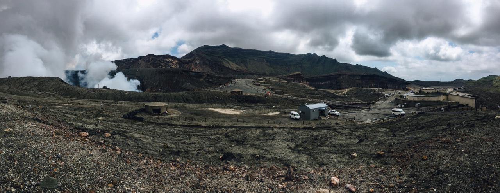

# *Kumamoto's Best!!!*
## Brief History

“Kumamoto is famous for "Mount Aso" where one of the world's largest calderas lies, and the beautiful sea around "Amakusa"—a group of 120 islands. Both the mountains of Aso and the sea of Amakusa are designated as national parks by the Japanese Government. It's these two "mountain" and "sea" national parks which make Kumamoto a unique land, even in Japan. There is a famous active volcano resides in Aso. The energy coming from this volcano blesses Kumamoto with many charming hot-springs. Kumamoto is one of Japan's most popular spots for hot-springs. Anyone soaks in a hot-spring here will feel relaxed both physically and mentally.”

Source: https://kumamoto.guide/en/about/
-------------------------------------------

### Enjoy!
-------------------------------------------
On our way to the destination, we decided to take a break at one of the rest stops, and this is what welcomed us. An over looking view of the rice fields and the mountains. What a picture-perfect moment!

-------------------------------------------

  After the long drive, we finally reached our first stop; the famous Mt. Aso. It was a great experience being at the top of an active volcano — an experience I'll never forget. &#128513; &#128513; &#128513;

---------------------------------------------

